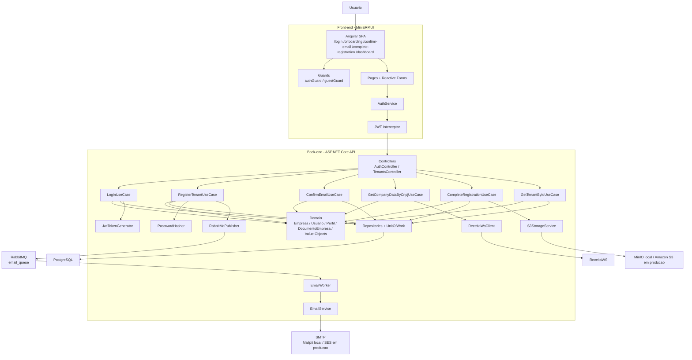

# Arquitetura Atual do MiniERP

Este documento descreve a arquitetura efetivamente implementada hoje no repositorio. O foco aqui e a topologia real da aplicacao em desenvolvimento local, com observacoes pontuais sobre a producao quando relevante.

## Visao geral

## Fluxos principais

### Onboarding inicial

1. O usuario acessa `/onboarding` no Angular.
2. O `AuthService` envia `POST /api/Tenants/register`.
3. `RegisterTenantUseCase` cria `Empresa` com status `AguardandoConfirmacaoEmail`, cria `Usuario`, associa o perfil `Admin`, salva no banco e publica uma mensagem na fila `email_queue`.
4. `EmailWorker` consome a fila e usa `EmailService` para enviar o e-mail de confirmacao.

### Confirmacao de e-mail

1. O link de e-mail aponta para `/confirm-email?token=...` no front-end.
2. A pagina chama `GET /api/Tenants/confirm-email`.
3. `ConfirmEmailUseCase` busca a empresa pelo token, invalida o token e muda o status para `AguardandoDadosCompletos`.

### Autenticacao

1. O usuario acessa `/login`.
2. O front envia `POST /api/Auth/login`.
3. `LoginUseCase` valida usuario, senha e status do tenant.
4. `JwtTokenGenerator` devolve um JWT com dados do usuario e perfis.
5. O token e salvo no `localStorage`, e o `jwtInterceptor` injeta `Authorization: Bearer ...` nas chamadas autenticadas.

### Completar cadastro

1. O usuario autenticado em status `AguardandoDadosCompletos` e redirecionado para `/complete-registration`.
2. O front usa `GET /api/Tenants/{id}` para obter o CNPJ do tenant.
3. O front consulta `GET /api/Tenants/cnpj-data/{cnpj}` para buscar dados da ReceitaWS.
4. O formulario final envia `POST /api/Tenants/complete-registration` com `multipart/form-data`.
5. `CompleteRegistrationUseCase` salva os dados da empresa, faz upload dos arquivos em storage S3-compatible e ativa o tenant.

## Camadas e responsabilidades

- `MiniERP.Api`: exposicao HTTP, configuracao de autenticacao, CORS, middleware global e worker hospedado
- `MiniERP.Application`: orquestracao dos casos de uso e DTOs de entrada/saida
- `MiniERP.Domain`: regras centrais, entidades, enums e contratos
- `MiniERP.Infrastructure`: persistencia, adaptadores externos e implementacoes tecnicas
- `MiniERP.UI`: experiencia do usuario, formularios, navegacao protegida e consumo da API

## Infraestrutura local x producao

### Local

- PostgreSQL, RabbitMQ, Mailpit e MinIO sobem pelo `docker-compose.yml`
- API usa `appsettings.json` com endpoints locais
- UI pode rodar por `docker compose` ou `npm start`

### Producao

O repositorio ja possui `docker-compose.prod.yml` e workflow GitHub Actions para publicar imagens e acionar deploy. Na configuracao versionada, o estadoful principal fora dos containers e esperado em servicos externos, como banco gerenciado, SMTP/SES e S3.

## Observacoes atuais

- a arquitetura de seguranca ainda pode ser endurecida, especialmente no fluxo de completar cadastro
- o endpoint de consulta de CNPJ esta aberto na implementacao atual
- o front-end possui guards e interceptor implementados, mas a suite de testes Angular esta quebrada hoje
